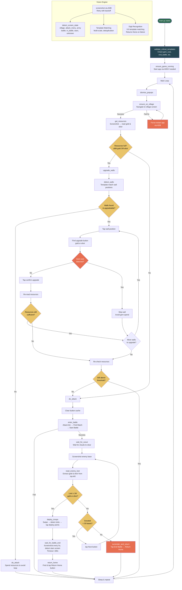

# Process Flow

```mermaid
flowchart TD
    START([main.py starts]) --> VALIDATE[validate_critical_templates\nCheck gem_cost, end_battle, etc.]
    VALIDATE --> ENSURE_GAME[ensure_game_running\nStart app via ADB if needed]
    ENSURE_GAME --> LOOP[Main Loop]

    LOOP --> DISMISS[dismiss_popups]
    DISMISS --> ENSURE_VILLAGE[ensure_on_village\nNavigate to village screen]
    ENSURE_VILLAGE -- Success --> READ_RES[get_resources\nScreenshot → read gold & elixir]
    ENSURE_VILLAGE -- Fail 5x --> RESTART_APP[Force-restart app\nvia ADB] --> ENSURE_VILLAGE

    READ_RES --> CHECK{Resources full?\n≥8M gold OR elixir}

    CHECK -- Yes --> WALLS[upgrade_walls]
    CHECK -- No --> ATTACK[do_attack]

    %% Wall Upgrade Flow
    WALLS --> DETECT_WALLS[detect_walls\nTemplate match wall positions]
    DETECT_WALLS --> WALLS_FOUND{Walls found\n& upgradeable?}
    WALLS_FOUND -- No --> FORCE_ATTACK[do_attack\nSpend resources to avoid loop]
    WALLS_FOUND -- Yes --> TAP_WALL[Tap wall position]
    TAP_WALL --> FIND_UPGRADE[Find upgrade button\ngold or elixir]
    FIND_UPGRADE --> GEM_CHECK{Gem cost\ndetected?}
    GEM_CHECK -- No --> CONFIRM_UPGRADE[Tap confirm upgrade]
    GEM_CHECK -- Yes --> SKIP_WALL[Skip wall\nAvoid gem spend]
    CONFIRM_UPGRADE --> RECHECK_RES[Re-read resources]
    SKIP_WALL --> MORE_WALLS{More walls\nto upgrade?}
    RECHECK_RES --> RES_OK{Resources still\nsufficient?}
    RES_OK -- Yes --> MORE_WALLS
    RES_OK -- No --> POST_WALL_CHECK
    MORE_WALLS -- Yes --> TAP_WALL
    MORE_WALLS -- No --> POST_WALL_CHECK[Re-check resources]
    POST_WALL_CHECK --> STILL_FULL{Still above\nthreshold?}
    STILL_FULL -- No --> ATTACK
    STILL_FULL -- Yes --> SLEEP

    %% Attack Flow
    ATTACK --> CLEAR_CACHE[Clear button cache]
    CLEAR_CACHE --> ENTER_BATTLE[enter_battle\nAttack btn → Find Match → Start Battle]
    ENTER_BATTLE -- Fail --> SLEEP
    ENTER_BATTLE -- Success --> WAIT_CLOUDS[wait_for_scout\nWait for clouds to clear]
    WAIT_CLOUDS --> SCOUT[Screenshot enemy base]
    SCOUT --> READ_LOOT[read_enemy_loot\nExtract gold & elixir from top-left]
    READ_LOOT --> LOOT_CHECK{Loot ≥ 1M\ngold or elixir?}

    LOOT_CHECK -- Yes --> DEPLOY[deploy_troops\nSwipe → detect slots → tap deploy points]
    LOOT_CHECK -- No --> NEXT_CHECK{Scouted\n< 30 bases?}
    NEXT_CHECK -- Yes --> NEXT[tap Next button] --> SCOUT
    NEXT_CHECK -- No --> SURRENDER[surrender_and_return\nTap End Battle → Return Home]

    DEPLOY --> WAIT_END[wait_for_battle_end\nScreenshot every 5s, detect stars screen\nTimeout: 180s]
    WAIT_END --> RETURN_HOME[return_home\nFind & tap Return Home button]

    FORCE_ATTACK --> SLEEP
    SURRENDER --> SLEEP
    RETURN_HOME --> SLEEP[Sleep & repeat]
    SLEEP --> LOOP

    %% Screen State Detection (used throughout)
    subgraph Vision Engine
        direction TB
        SS[screenshot via ADB\nRetry with backoff]
        DSS[detect_screen_state\nvillage, attack_menu, army\nbattle, in_battle, stars, unknown]
        TM[Template Matching\nMulti-scale, deduplication]
        OCR[Digit Recognition\n0-9 template matching\nReturns None on failure]
        SS --> DSS
        SS --> TM
        SS --> OCR
    end

    style START fill:#2d6a4f,color:#fff
    style VALIDATE fill:#264653,color:#fff
    style CHECK fill:#e9c46a,color:#000
    style GEM_CHECK fill:#e76f51,color:#fff
    style LOOT_CHECK fill:#e9c46a,color:#000
    style NEXT_CHECK fill:#e9c46a,color:#000
    style WALLS_FOUND fill:#e9c46a,color:#000
    style RES_OK fill:#e9c46a,color:#000
    style STILL_FULL fill:#e9c46a,color:#000
    style RESTART_APP fill:#e76f51,color:#fff
    style SURRENDER fill:#e76f51,color:#fff
```
